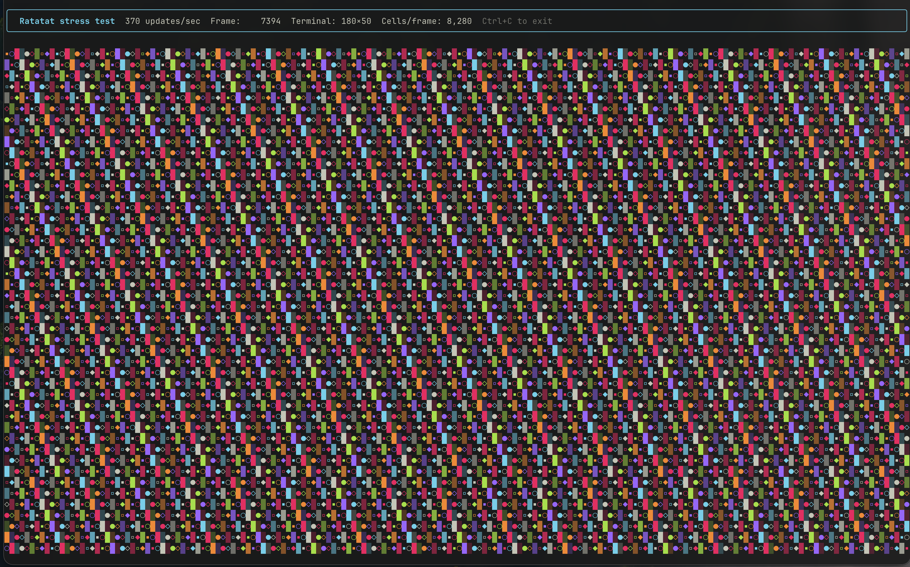
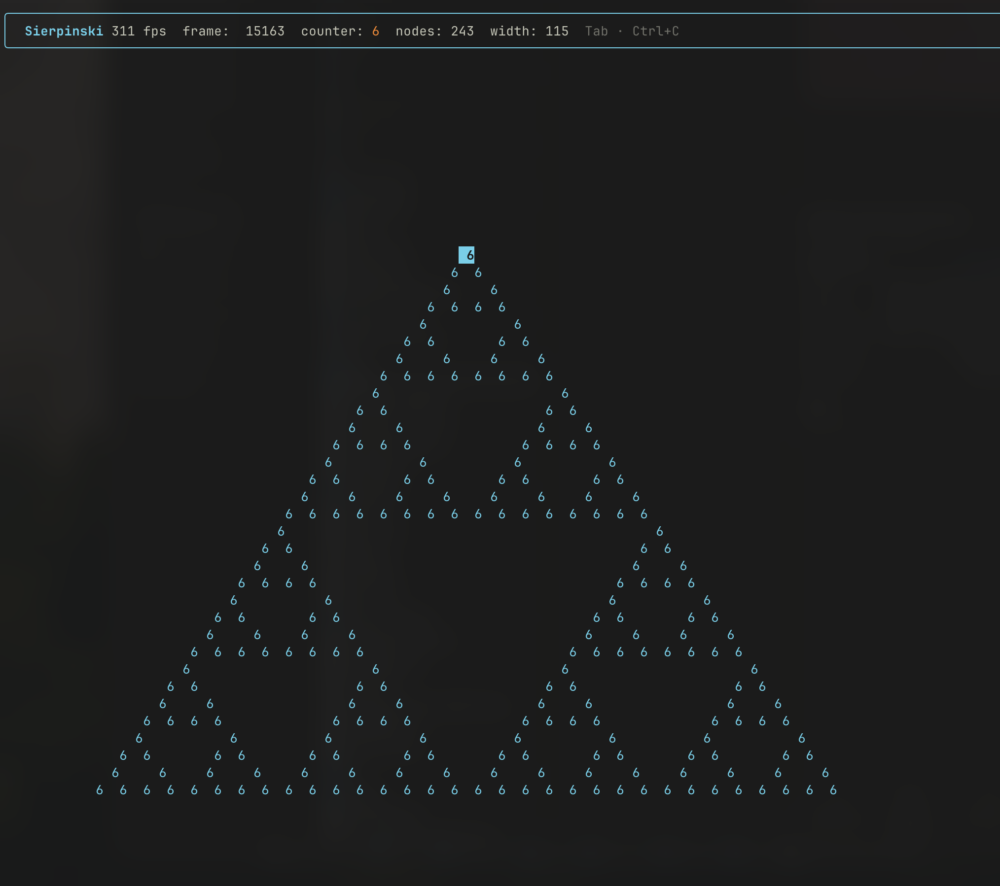

# Ratatat (Ratatui + Ink)

> 100% Vibe Coded — Fork Only, no PRs

An Ink compatible React reconciler for the terminal — write TUI apps with React components, powered by a native Rust diff engine and Yoga Flexbox.



```tsx
import { render, Box, Text, useInput } from 'ratatat'
import React, { useState } from 'react'

function Counter() {
  const [count, setCount] = useState(0)
  useInput((input, key) => {
    if (key.upArrow) setCount((c) => c + 1)
    if (key.downArrow) setCount((c) => c - 1)
  })
  return (
    <Box flexDirection="column" padding={1}>
      <Text bold color="cyan">
        Counter
      </Text>
      <Text>
        Count: <Text color="green">{count}</Text>
      </Text>
      <Text dim>↑↓ to change · Ctrl+C to exit</Text>
    </Box>
  )
}

render(<Counter />)
```

## Why Ratatat?

|                                | Ratatat      | Ink         | Speedup   |
| ------------------------------ | ------------ | ----------- | --------- |
| Initial mount (simple)         | 67,630 ops/s | 8,215 ops/s | **8.2×**  |
| Initial mount (complex)        | 41,253 ops/s | 1,421 ops/s | **29×**   |
| Rerender (simple)              | 95,175 ops/s | 8,095 ops/s | **11.8×** |
| Rerender (complex)             | 49,852 ops/s | 1,384 ops/s | **36×**   |
| p99 latency (complex rerender) | **23µs**     | 1,585µs     | **68×**   |

Stress test: **303 FPS** sustained on a 188×50 terminal (8,648 cells/frame), running indefinitely.

The speed comes from two architectural decisions:

1. **Native Rust diff engine** — compares `Uint32Array` cell buffers and emits minimal ANSI escape sequences. Zero JS allocations in the hot path.
2. **`prepareUpdate` short-circuits** — returns `null` when props are unchanged, so React skips `commitUpdate` for unmodified nodes entirely.

## Features

- **React 19** — full hooks support: `useState`, `useEffect`, `useRef`, `useCallback`, `useMemo`, `useTransition`, `Suspense`
- **Flexbox layout** — Yoga engine, same API as React Native / Ink
- **Box model** — borders (`single`, `double`, `round`, `bold`, `arrow`), padding, margin, gap
- **Text styling** — `color`, `backgroundColor`, `bold`, `italic`, `dim`, `underline`, 256-color, hex, rgb
- **Input handling** — `useInput`, `useStdin`, keyboard + special keys
- **Focus management** — `useFocus`, `useFocusManager`, Tab cycling
- **Terminal hooks** — `useWindowSize`, `useStdout`, `useStderr`
- **App lifecycle** — `useApp().exit()`, SIGWINCH resize, alternate screen, raw mode
- **Ink-compatible API** — most Ink apps work with a one-line import change

## Architecture

```
React components
      │  setState / props change
      ▼
React Reconciler (src/reconciler.ts)
  prepareUpdate → null if props unchanged (skips commitUpdate)
  commitUpdate  → applyStyles() to Yoga node
      │
      ▼
Yoga layout engine (src/layout.ts)
  calculateLayout() → computes x/y/width/height for every node
      │
      ▼
Buffer painter (src/renderer.ts)
  renderTreeToBuffer() → writes (charCode, attrCode) pairs into Uint32Array
      │  zero-copy buffer pointer passed to Rust
      ▼
Rust diff engine (src/lib.rs, src/ansi.rs)
  compares front/back buffer → emits minimal ANSI escape sequences
      │
      ▼
process.stdout
```

**Buffer format:** `Uint32Array` with `width × height × 2` elements.  
Cell at `(x, y)`: index `= (y × cols + x) × 2`

- `buffer[idx]` = Unicode codepoint (u32)
- `buffer[idx+1]` = `(styles << 16) | (bg << 8) | fg` (all u8)

## Installation

> Don't do this — for me only

```bash
npm install https://github.com/geoffmiller/ratatat/releases/latest/download/ratatat.tgz
```

Or pin to a specific version:

```bash
npm install https://github.com/geoffmiller/ratatat/releases/download/v0.1.0/ratatat.tgz
```

Or in `package.json`:

```json
"dependencies": {
  "ratatat": "https://github.com/geoffmiller/ratatat/releases/latest/download/ratatat.tgz"
}
```

Requires Node 20+. Prebuilt native binaries for macOS (arm64, x64), Linux (x64, arm64), and Windows (x64) are bundled in the release tarball.

## Usage

```bash
# Run an example
node --import @oxc-node/core/register examples/counter.tsx

# Or with tsx
npx tsx examples/counter.tsx
```

## Examples

```
examples/
  counter.tsx          — increment/decrement with arrow keys
  borders.tsx          — all border styles
  justify-content.tsx  — flexbox alignment demo
  use-input.tsx        — keyboard input handling
  box-backgrounds.tsx  — background colors
  chat.tsx             — scrolling message list
  terminal-resize.tsx  — live window size display
  use-stderr.tsx       — writing to stderr
  use-stdout.tsx       — writing to stdout
  suspense.tsx         — React Suspense with async data
  use-transition.tsx   — useTransition for non-blocking updates
  concurrent-suspense.tsx — concurrent rendering
  use-focus.tsx        — focus management
  use-focus-with-id.tsx   — named focus groups
  static.tsx           — <Static> append-only task log
  stress-test.tsx      — 300+ FPS full-terminal color animation
  sierpinski.tsx       — React Fiber Sierpinski triangle (243 nodes, pulsing width)
  kitchen-sink.tsx     — all features in one app
```



## API — copied from Ink

### `render(element)`

Mount a React element into the terminal. Returns `{ app, input }`.

```tsx
const { app, input } = render(<App />)
```

### `<Box>`

Flexbox container. All Yoga layout props supported.

```tsx
<Box
  flexDirection="row" // 'row' | 'column' (default: 'row')
  justifyContent="space-between"
  alignItems="center"
  padding={1}
  paddingX={2}
  margin={1}
  gap={1}
  width={40}
  height="100%"
  borderStyle="round" // 'single'|'double'|'round'|'bold'|'arrow'
  borderColor="cyan"
>
  ...
</Box>
```

### `<Text>`

Inline text with optional styling.

```tsx
<Text
  color="green" // named, hex (#ff0000), rgb (rgb(255,0,0))
  backgroundColor="blue"
  bold
  italic
  dim
  underline
>
  Hello world
</Text>
```

### `<Newline>`

Inserts a line break inside a `<Text>` node.

```tsx
<Text>
  line one
  <Newline />
  line two
</Text>
```

### `<Spacer>`

Expands to fill available space in a flex container, pushing siblings apart.

```tsx
<Box>
  <Text>left</Text>
  <Spacer />
  <Text>right</Text>
</Box>
```

### `<Static>`

Append-only list — items are rendered once and never re-rendered. Use for streaming output (build logs, test results) where the history should be frozen and only new items added.

```tsx
<Static items={completedTasks}>
  {(task) => (
    <Box key={task.id}>
      <Text color={task.ok ? 'green' : 'red'}>{task.name}</Text>
    </Box>
  )}
</Static>
```

### Hooks

```tsx
// Input
useInput((input, key) => {
  if (key.return) { ... }
  if (key.escape) { ... }
  if (key.ctrl && input === 'c') { ... }
})

// App lifecycle
const { exit } = useApp()

// Terminal size
const { columns, rows } = useWindowSize()

// Focus
const { isFocused } = useFocus({ id: 'my-panel' })
const { focus } = useFocusManager()

// Stdout / stderr
const { write } = useStdout()
const { write } = useStderr()
```

## Development

```bash
npm run build      # Rust native add-on (napi-rs)
npm run build:ts   # TypeScript
npm test           # 118 tests
```

## License

MIT
