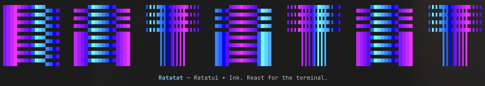
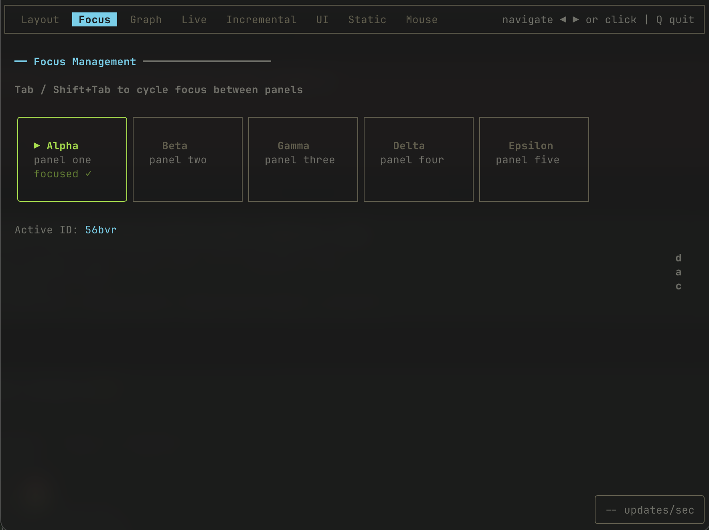
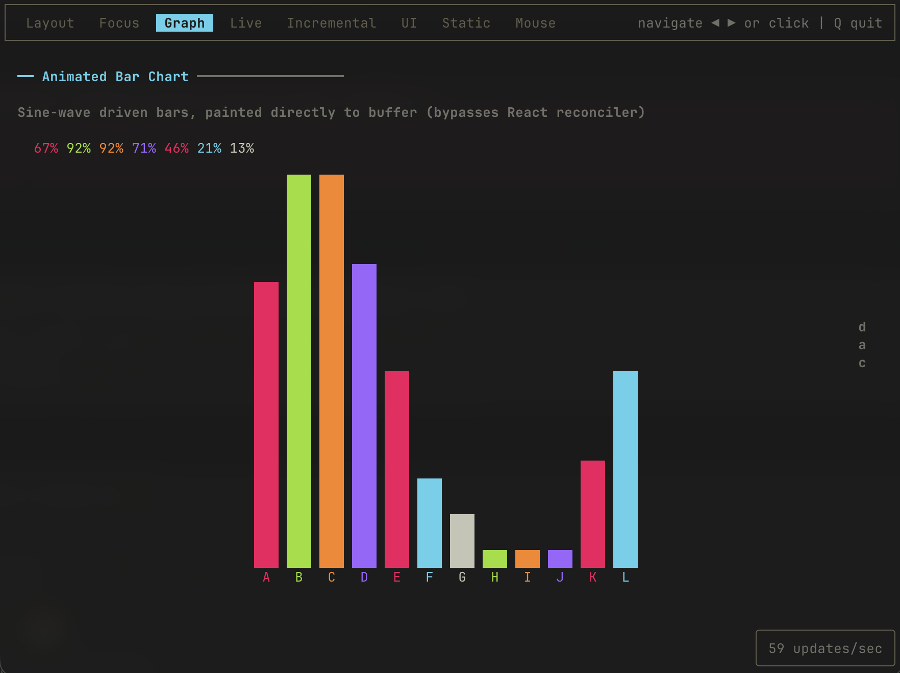

# Ratatat Monorepo

> Ratatat started as a simple question to an LLM - "Why is Ink slow and Ratatui fast, and don't say because Rust?". From there it turned into a research experiment in both architecture and also to see how far I could take a 100% vibe-coded app as a seasoned software engineer.
> After a few weeks of slowly building out features, refactoring, reorganizing, testing, and more, the end result was this monorepo with what I consider the "crown jewel" - the frontend-agnostic `core` package. This uses what most would consider a game engine rendering loop to achieve full-screen updates at over 700fps while being able to ingest any TypeScript code via a double-buffered `Uint32Array`. I hope you enjoy it and have as much fun reading and using the code as I do.

> [!WARNING]
> Recommended workflow: fork/clone and build/install from source for the latest changes.
> npm packages (when used) may lag behind `main`.

Ratatat is organized as a monorepo with separate packages for the core runtime, React adapter, ink-fast research implementation, and shared docs.

## Packages at a glance

| Package                            | Purpose                                                        | More info                                              |
| ---------------------------------- | -------------------------------------------------------------- | ------------------------------------------------------ |
| [`@ratatat/core`](packages/core)   | TypeScript-facing runtime powered by a native Rust diff engine | [`packages/core/README.md`](packages/core/README.md)   |
| [`@ratatat/react`](packages/react) | React adapter + Ink-compatible components/hooks                | [`packages/react/README.md`](packages/react/README.md) |
| [`@ratatat/ink`](packages/ink)     | `ink-fast` implementation and performance R&D fork             | [`packages/ink/readme.md`](packages/ink/readme.md)     |
| [`@ratatat/docs`](packages/docs)   | Unified docs for all packages (private workspace package)      | [`packages/docs/index.md`](packages/docs/index.md)     |

## `@ratatat/core` — TypeScript → Rust TUI runtime

`@ratatat/core` is the low-level runtime for raw-buffer and non-React terminal apps.

Primary APIs include `Renderer`, `TerminalGuard`, `InputParser`, and `createInlineLoop`.

### Core visuals


_Stress test sustained ~700 FPS._

<video src="packages/docs/media/ratatat-ascii-3d-cube-demo.mp4" controls muted loop playsinline></video>

_ASCII 3D cube demo (raw-buffer mode)._ If your viewer doesn't render embedded video, open [`packages/docs/media/ratatat-ascii-3d-cube-demo.mp4`](packages/docs/media/ratatat-ascii-3d-cube-demo.mp4).

### Core perf snapshot

Measured on Apple M1 Max, 80×24 terminal.

| Metric                              | Value              |
| ----------------------------------- | ------------------ |
| Stress render rate                  | ~700 FPS sustained |
| Startup median (`ratatat core/raw`) | 135.99 ms          |
| Startup p95 (`ratatat core/raw`)    | 140.92 ms          |

## `@ratatat/react` — Ink-compatible React layer

`@ratatat/react` provides the React reconciler, Yoga layout integration, components, and hooks.

### React visuals (kitchen sink)

| Layout                                                    | Focus                                                   | Graph                                                   | Live                                                  |
| --------------------------------------------------------- | ------------------------------------------------------- | ------------------------------------------------------- | ----------------------------------------------------- |
|  |  |  |  |

| Incremental                                                         | UI                                                | Static                                                    | Mouse                                                   |
| ------------------------------------------------------------------- | ------------------------------------------------- | --------------------------------------------------------- | ------------------------------------------------------- |
|  |  |  |  |

### React perf snapshot (Ratatat React vs Ink)

Measured on Apple M1 Max, 80×24 terminal.

| Metric                  | Unit              | Ratatat React |    Ink | Speedup |
| ----------------------- | ----------------- | ------------: | -----: | ------: |
| Initial mount (simple)  | ops/sec           |        67,630 |  8,215 |    8.2× |
| Initial mount (complex) | ops/sec           |        41,253 |  1,421 |     29× |
| Rerender (simple)       | ops/sec           |        95,175 |  8,095 |   11.8× |
| Rerender (complex)      | ops/sec           |        49,852 |  1,384 |     36× |
| p99 latency (complex)   | µs (lower better) |            23 |  1,586 |     68× |
| Startup median          | ms                |        295.26 | 313.67 |   1.06× |

## `@ratatat/ink` — ink-fast research fork

`@ratatat/ink` contains the standalone `ink-fast` implementation and benchmark harnesses.

### ink-fast perf snapshot

| Workload          | Baseline | Optimized |   Delta |
| ----------------- | -------: | --------: | ------: |
| Dense render      | 0.163958 |  0.159750 |  -2.57% |
| Unicode render    | 5.254292 |  5.244208 |  -0.19% |
| Sparse render     | 0.049833 |  0.046375 |  -6.94% |
| ANSI-dense stress | 1.040646 |  0.507250 | -51.26% |

More: [`packages/ink/TECHNICAL-README.md`](packages/ink/TECHNICAL-README.md)

## `@ratatat/docs`

All docs live in one place under `packages/docs`:

- [Docs index](packages/docs/index.md)
- [Getting started](packages/docs/getting-started.md)
- [React quickstart](packages/docs/quickstart-react.md)
- [Raw-buffer quickstart](packages/docs/quickstart-raw-buffer.md)

## Workspace commands

From repo root:

```bash
npm install
npm run build
npm test
```

Target a package:

```bash
npm run build -w @ratatat/core
npm run test -w @ratatat/react
npm run bench:render -w @ratatat/ink
```
