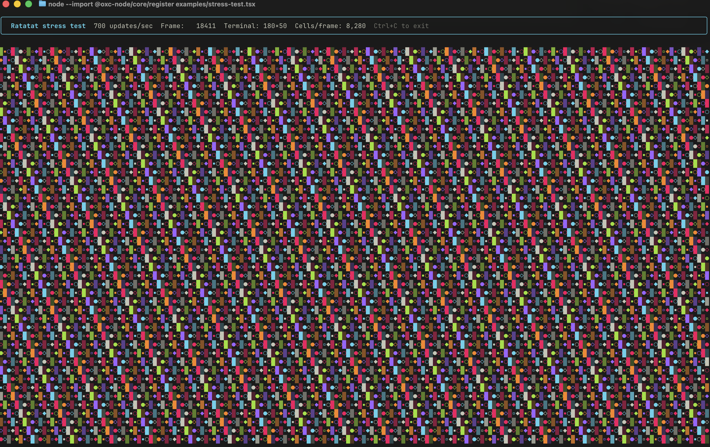
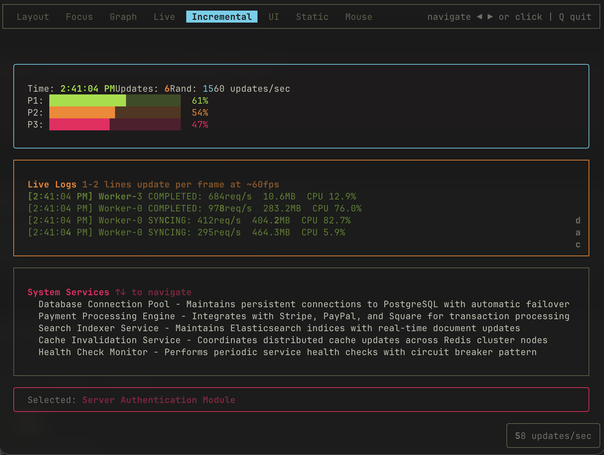
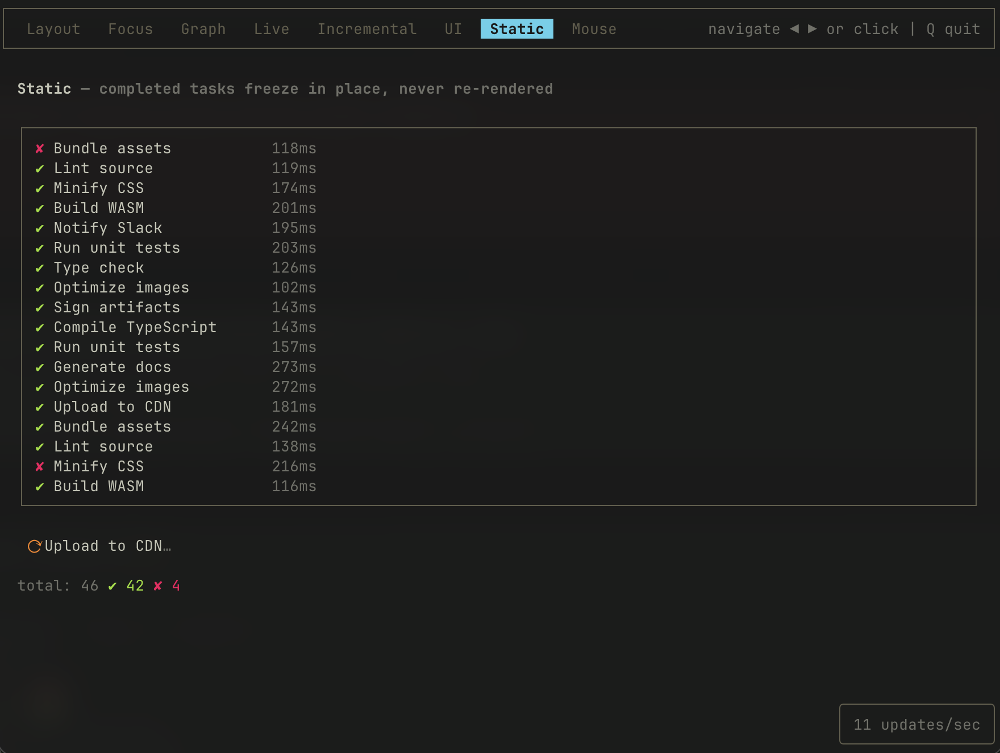

# Ratatat ([Ratatui](https://ratatui.rs) + [Ink](https://github.com/vadimdemedes/ink))

> 100% vibe code. Fork/clone only - no PRs

An Ink-compatible React renderer for terminal UIs, powered by a native Rust diff engine and Yoga Flexbox.

**[📖 Documentation](docs/index.md)** · **[Getting Started](docs/getting-started.md)** · **[Components](docs/components.md)** · **[Hooks](docs/hooks.md)**

**[Ink Compatibility](docs/ink-compat.md)** · **[Raw Buffer API](docs/raw-buffer.md)** · **[Render Loop](docs/render-loop.md)** · **[Architecture Decisions](docs/decisions.md)**

Primary entry points: `ratatat/react` (React adapter) and `ratatat/core` (framework-agnostic runtime). Root `ratatat` imports remain supported for compatibility.



_Stress test now sustains ~700 FPS._

<video src="https://github.com/user-attachments/assets/62ae2569-f036-431b-a359-1b439461ebb4" controls muted loop playsinline></video>

_ASCII 3D cube demo (raw-buffer mode)._  
If your markdown viewer doesn't render embedded video, use: [`docs/media/ratatat-ascii-3d-cube-demo.mp4`](docs/media/ratatat-ascii-3d-cube-demo.mp4)

| Layout                                           | Focus                                          | Graph                                          | Live                                         |
| ------------------------------------------------ | ---------------------------------------------- | ---------------------------------------------- | -------------------------------------------- |
|  |  |  |  |

| Incremental                                                | UI                                       | Static                                           | Mouse                                          |
| ---------------------------------------------------------- | ---------------------------------------- | ------------------------------------------------ | ---------------------------------------------- |
|  |  |  |  |

## Benchmark snapshot (Ratatat vs Ink)

Measured on Apple M1 Max, 80×24 terminal.

| Metric                  | Unit               | Ratatat | Ink   | Speedup |
| ----------------------- | ------------------ | ------- | ----- | ------- |
| Initial mount (simple)  | ops/sec            | 67,630  | 8,215 | 8.2×    |
| Initial mount (complex) | ops/sec            | 41,253  | 1,421 | 29×     |
| Rerender (simple)       | ops/sec            | 95,175  | 8,095 | 11.8×   |
| Rerender (complex)      | ops/sec            | 49,852  | 1,384 | 36×     |
| p99 latency (complex)   | µs (lower is best) | 23      | 1,586 | 68×     |

### Startup benchmark (50 runs)

Metric: **time-to-marker (ms)** in a PTY (`script`) — process start to first visible render marker.

| Suite                | Median startup (ms) | p95 (ms) | Over Node baseline (ms) |
| -------------------- | ------------------- | -------- | ----------------------- |
| Node baseline        | 149.21              | 155.57   | 0.00                    |
| Ratatat (core/raw)   | 135.99              | 140.92   | -13.22                  |
| Ratatat (React mode) | 295.26              | 302.43   | 146.05                  |
| Ink                  | 313.67              | 324.48   | 164.46                  |

Ratatat React adapter overhead (vs Ratatat core) is **159.27ms** in this run (**2.17×**).
Ratatat React startup is basically equivalent but **18.41ms faster** than Ink (**1.06×**).

> Note: `ratatat (core/raw)` can appear faster than the `node baseline` row because the baseline marker is written through Node's stdout path, while core marker output goes through the native renderer write path. For framework overhead, use `ratatat (react mode) - ratatat (core/raw)`.

Re-run: `RUNS=50 WARMUP=3 npm run bench:startup`

## Installation (short)

- **Preferred:** fork/clone this repo and build from source.

  ```bash
  git clone https://github.com/geoffmiller/ratatat.git
  cd ratatat
  npm install
  npm run build
  ```

- **Prebuilt tarball (macOS arm64 local artifact):**

  ```bash
  npm install ./builds/macos-arm64/ratatat-0.1.1-macos-arm64.tar.gz
  ```

  ⚠️ Do not blindly install binaries/tarballs from strangers on the internet. Trust source, verify checksums, and prefer building from source. See [`builds/README.md`](builds/README.md).

- App code imports from the package name:

  ```tsx
  import { render, Box, Text } from 'ratatat/react'
  ```

  Run commands and demo list: [docs/examples.md](docs/examples.md)

## Minimal React example

```tsx
import { render, Box, Text, useInput } from 'ratatat/react'
import React, { useState } from 'react'

function Counter() {
  const [count, setCount] = useState(0)

  useInput((_input, key) => {
    if (key.upArrow) setCount((c) => c + 1)
    if (key.downArrow) setCount((c) => c - 1)
  })

  return (
    <Box flexDirection="column" padding={1}>
      <Text bold color="cyan">
        Counter
      </Text>
      <Text>Count: {count}</Text>
      <Text dim>↑↓ to change · Ctrl+C to exit</Text>
    </Box>
  )
}

render(<Counter />)
```

More React examples: [`examples/`](examples/)

## Minimal No React / Pure TS example

```ts
import { Renderer, TerminalGuard, terminalSize } from 'ratatat/core'

const guard = new TerminalGuard()
const { cols, rows } = terminalSize()
const renderer = new Renderer(cols, rows)
const buf = new Uint32Array(cols * rows * 2)

const msg = 'Hello from pure TS (no React)'
for (let i = 0; i < msg.length && i < cols; i++) {
  const idx = (1 * cols + i) * 2
  buf[idx] = msg.codePointAt(i)!
  buf[idx + 1] = 46 // green fg
}

renderer.render(buf)

setTimeout(() => {
  guard.leave()
  process.exit(0)
}, 3000) // exit after 3 seconds
```

More No React/Pure TS examples: [`examples-raw/`](examples-raw/)

If you're running from this repository, there's also a raw-mode helper harness at [`examples-raw/harness.ts`](examples-raw/harness.ts) (`createLoop`, `setCell`, etc.).

Harness example:

```ts
import { createLoop, setCell } from './examples-raw/harness.js'

const loop = createLoop((buf, cols, rows, frame) => {
  const msg = `frame ${frame}`
  for (let i = 0; i < msg.length && i < cols; i++) {
    setCell(buf, cols, i, 1, msg[i]!, 51)
  }
}, 30) // 30 FPS

loop.start()
```

## Feature summary

- React 19 rendering in a terminal (`ratatat/react`)
- Ink-compatible core API: `render`, `Box`, `Text`, `Static`, `useInput`, `useApp`, etc.
- Ratatat-only hooks/components: `useMouse`, `useTextInput`, `useScrollable`, `<Spinner>`, `<ProgressBar>`
- Inline rendering APIs: `renderInline()` (React) and `createInlineLoop()` (raw)
- React-free mode via `ratatat/core`: `Renderer` + `TerminalGuard` + direct `Uint32Array` painting

## Rendering modes

- **React mode**: `render(<App />)`
- **Inline mode**: `renderInline(<App />, { rows })`
- **Raw-buffer mode**: `new Renderer(cols, rows)` + `renderer.render(buf)`

See [Rendering Modes](docs/rendering-modes.md) for trade-offs.

## Run examples in this repository

```bash
# React examples
node --import @oxc-node/core/register examples/counter.tsx
node --import @oxc-node/core/register examples/kitchen-sink.tsx

# Raw-buffer examples
node --import @oxc-node/core/register examples-raw/conway.ts
node --import @oxc-node/core/register examples-raw/matrix.ts
```

Full list: [docs/examples.md](docs/examples.md)

## API notes

- `render()` returns `{ rerender, unmount, waitUntilExit, app, input }`
- `useApp()` returns `{ exit, quit }` (both call the same quit path)
- `useMouse()` reports **0-based** terminal coordinates (`x`, `y`)
- Inline loops currently terminate the process when stopped
- `useCursor()` and `useIsScreenReaderEnabled()` are compatibility stubs

For full parity details and caveats: [docs/ink-compat.md](docs/ink-compat.md)

## Runtime requirements

- Node.js 20+
- A real TTY (Terminal.app, iTerm2, Ghostty, kitty, etc.)

## License

MIT
